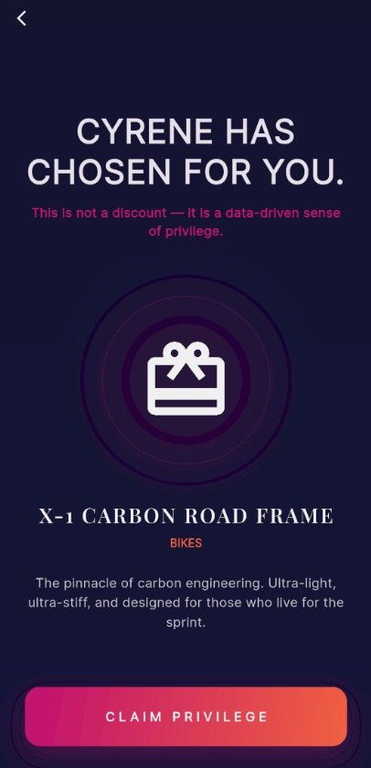

# Cyrene Data Collective

Cyrene is an end-to-end analytical solution developed using the **AdventureWorks** dataset. It leverages machine learning to identify high-value customer segments and predicts the probability of customers reaching "Elite" status to drive personalized marketing strategies.

## The Analytical Workflow

### 1. Exploratory Data Analysis (EDA) & Cleaning
We performed an extensive EDA to transform raw transactional data into meaningful insights:
- **Data Cleaning:** Handled inconsistencies in the AdventureWorks relational database and standardized currency/date formats.
- **Behavioral Analysis:** Analyzed purchasing patterns across different demographics and product categories (Bikes, Components, Clothing, Accessories).
- **Outlier Detection:** Identified high-frequency shoppers to distinguish between standard customers and potential "Stars."

### 2. Feature Engineering
To improve model accuracy, we engineered specialized features:
- **Diversity Score:** Capturing the variety of product categories a customer interacts with.
- **Avg_Discount:** Measuring sensitivity to promotions.
- **Weekend Rate:** Analyzing shopping habits based on time-of-week.

### 3. Customer Segmentation (Clustering)
Using **K-Means Clustering**, we grouped customers into 4 distinct "Tribes" based on their purchasing DNA:
- **Pure Performers, Gearheads, Adventurous Mixers, and Style Icons.**

### 4. VIP Probability Model (Random Forest)
The core of Cyrene is a **Random Forest Classifier** that calculates the specific probability of a customer becoming a VIP member.
- **Objective:** Instead of a simple Yes/No, the model outputs a **Probability Score (0 to 1)**.
- **Performance:** Achieved a **0.86 ROC-AUC score**, indicating high predictive power.
- **Feature Importance:** `Avg_Discount` and `Diversity` were identified as the primary drivers of VIP potential.

---

## Management Console (Web Interface)
Powered by **Streamlit**, this web application serves as the "brain" for marketing teams. 
- **Real-time Scoring:** Instantly calculates the VIP probability for any customer.
- **Tribe Analytics:** Visualizes the distribution of "Pure Performers," "Gearheads," and other segments.
- **Actionable Insights:** Lists the top 10 potential "Star" customers for immediate retention campaigns.
> *File: `cyrene.py`*

## VIP Mobile App (Customer Experience)
While the web engine handles the data, the mobile application delivers the value.
- **Limited Edition Access:** Offers custom product feeds based on the customer's predicted "Tribe."
- **Elite Status Rewards:** Personalized interface for customers with a probability score above 0.80.
- **Visual Prototype:** Showcased via high-fidelity UI/UX screenshots in the `assets/` folder.

> [!TIP]
> *The mobile application UI serves as a bridge between data science and product design, demonstrating the commercial viability of the model.*

  
  

---

##  Tech Stack
- **Languages:** Python (Pandas, Scikit-Learn, Plotly)
- **Deployment:** Streamlit (Live Dashboard)
- **Visualization:** Power BI

- **Data Source:** AdventureWorks Dataset

